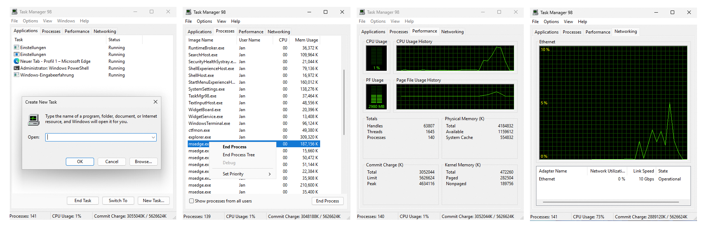

# Task Manager 98

Rewrite of the classic Windows 98, NT4 and Windows XP Task Manager for Windows 11 (arm64 and x86_64). It is rewritten based on and has feature parity with Task Manager Version 5.1 (Build 2600.xpsp_sp2_rtm.040803-2158) from 2001. Task Manager 98 is written in Go and only uses Windows system libraries for the User Interface and all its functionality. The original Task Manager 5.1 was written in C++ by Microsoft. The rewrite in Go ensures better memory safety while keeping very good performance as a self-contained binary.



## Installation

The fastest and easiest way is to install Task Manager 98 with an installer.

- **[Windows Installer for x64 (Intel and AMD)](https://github.com/jankammerath/TaskMgr98/releases/download/2026.9.27/TaskMgr98.x64.20260927.msi)**
- **[Windows Installer for Arm64 (Qualcomm etc.)](https://github.com/jankammerath/TaskMgr98/releases/download/2026.9.27/TaskMgr98.Arm64.20260927.msi)**

If you do not want to use an installer, you can download a ZIP-file that contains the EXE-file of Task Manager 98. There are no other files than the EXE-file needed to run Task Manager 98 on Windows 10 and Windows 11.

- [Standalone EXE-file for x64 (Intel and AMD)](https://github.com/jankammerath/TaskMgr98/releases/download/2026.9.27/TaskMgr98.x64.20260927.zip)
- [Standalone EXE-file for Arm64 (Qualcomm etc.)](https://github.com/jankammerath/TaskMgr98/releases/download/2026.9.27/TaskMgr98.Arm64.20260927.zip)

### Fixing the Defender Smart Screen

Executing `TaskMgr98.exe` or the respective installation MSI package may be blocked by Windows Defender. Execute the following PowerShell command to unblock the file for execution.

```powershell
Unblock-File -Path .\TaskMgr98.exe
```

Afterwards you're able to execute the application.

## Screenshots


## License

This software is published under the [Mozilla Public License Version 2.0](https://www.mozilla.org/en-US/MPL/).