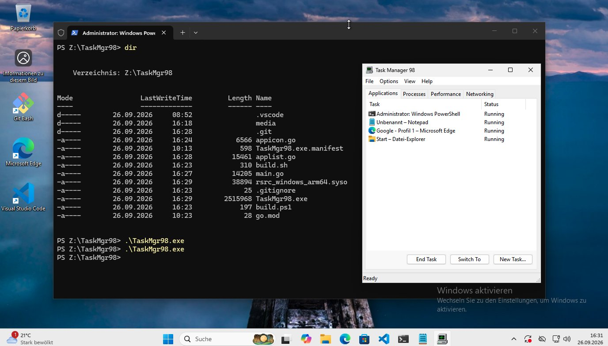
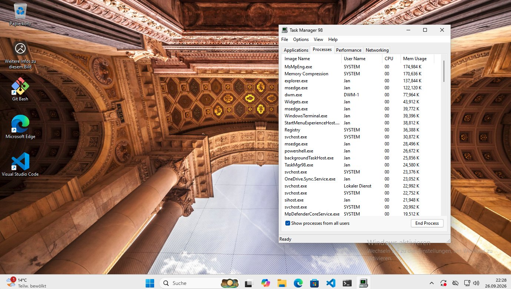
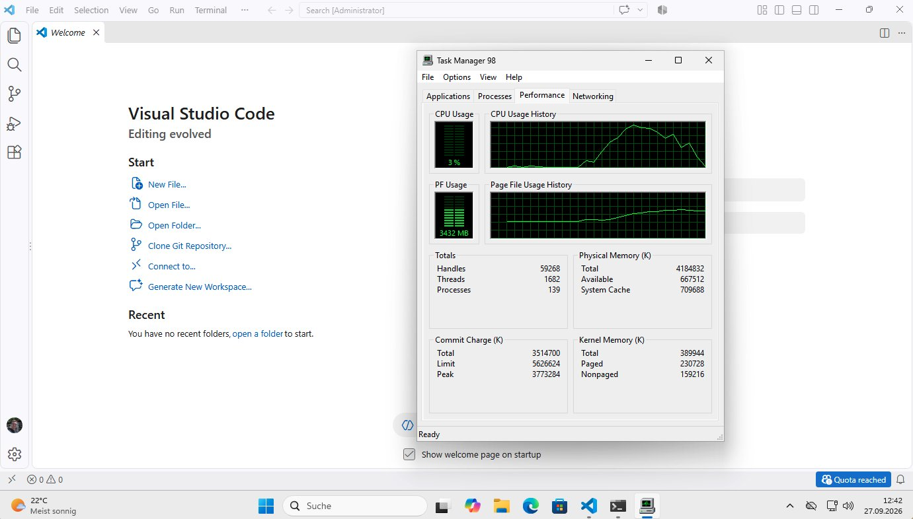
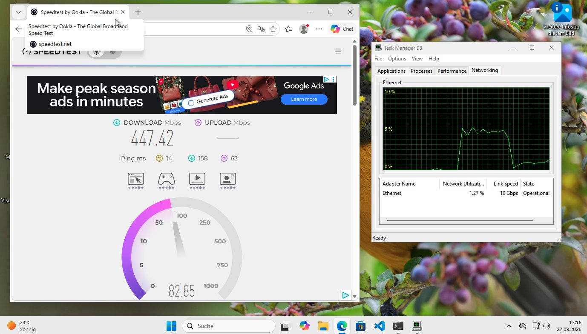

# Task Manager 98

Rewrite of the classic Windows 98, NT4 and Windows XP Task Manager for Windows 11 (arm64 and x86_64).

## Status

The application is work in progress, but the `master` branch should always compile for Windows 11 on arm64 and x86_64. 